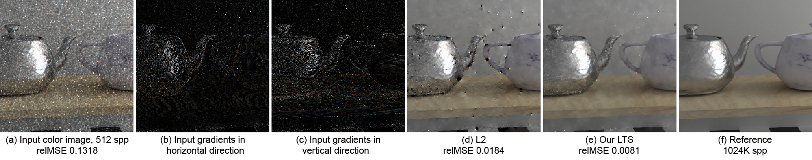

# [Gradient Outlier Removal for Gradient-Domain Path Tracing](https://cglab.gist.ac.kr/publications/2019_Outlier_Removal_for_Gradient-domain_Path_Tracing.html)

[Saerom Ha](https://cglab.gist.ac.kr/people.html), [Sojin Oh](https://cglab.gist.ac.kr/people.html), [Jonghee Back](https://cglab.gist.ac.kr/people.html), [Sung-Eui Yoon](https://sgvr.kaist.ac.kr/~sungeui/), [Bochang Moon](https://cglab.gist.ac.kr/people/bochang.html)



## Overview
This code is the implementation of the method demonstrated in the paper [Gradient Outlier Removal for Gradient-Domain Path Tracing](https://drive.google.com/open?id=1pV7C3DgXOLmAhW59Us97FR7MP3MU2zPT) by Ha et al. It is based on [gradient-domain path tracing (G-PT)](https://github.com/mmanzi/gradientdomain-mitsuba.git) by Kettunen et al., and improves the rendering quality by adding gradient outlier detection & removal process to G-PT. For more details, please refer to our [project page](https://cglab.gist.ac.kr/publications/2019_Outlier_Removal_for_Gradient-domain_Path_Tracing.html).

Our solution is separated into two parts.
- dependencies implemented on top of G-PT
- our gradient outlier removal project (RobustFit)

The first one is implemented on top of G-PT to get sample buffers, so G-PT framework which extended Mitsuba 0.5.0 should be set up beforehand. Please refer to the G-PT framework [(https://github.com/mmanzi/gradientdomain-mitsuba.git)](https://github.com/mmanzi/gradientdomain-mitsuba.git) for more details.

Using the sample buffers, our method (the second one) conduct reconstruction with detecting and rejecting gradient outliers.
This code is implemented and tested using Visual C++ 2013 and CUDA Toolkit 9.0 in Windows 10. Unfortunately, Linux and Mac OS are not supported yet. 

If there is any problem, question or comment, feel free to contact us:
<br>**Saerom Ha**(saeromm.ha@gmail.com), **Sojin Oh**(jaisonoh@gist.ac.kr) or **Jonghee Back**(jongheeback@gist.ac.kr) 

## Usage
### Build and Run

Gradient-domain rendering framework must be prepared first.

1. Prepare [gradient-domain path tracing (G-PT)](https://github.com/mmanzi/gradientdomain-mitsuba.git) framework
2. Build **RobustFit** project and copy **RobustFit.lib** and **cudart_static.lib** into **dependencies** folder of G-PT
    - Copy into *$(GPT_PATH)/dependencies/lib/x64_vc12/*
    - **cudart_static.lib** is located on *$(CUDA_PATH)/lib/x64/*
3. Copy source code files in the **RobustFit** project (9 code files) into **dependencies** folder of G-PT
    - Copy into *$(GPT_PATH)/dependencies/include/RobustFit/*
4. Unzip **robustfit_dependencies.zip** and overwrite the files in G-PT framework   
5. Build gradient-domain path tracing (G-PT) and run **mitsuba.exe** the same as the usage of G-PT

### Scene

Please make sure the xml scene files include attributes for using G-PT, as the scenes can be downloaded from G-PT project homepage [(https://mediatech.aalto.fi/publications/graphics/GPT/)](https://mediatech.aalto.fi/publications/graphics/GPT/). 

## License

All source code files in robustfit_dependencies.zip are released under the GNU GPLv3.
A software list that we use is as follow.

  - Mitsuba 0.5.0 released by Wenzel Jakob under the terms of the GNU GPLv3

Separately, the RobustFit project is under a BSD License.
Please refer to [our license file](https://github.com/CGLab-GIST/robust-fit/blob/master/license.txt).

## Citation

If you use our code or paper, please check below.

```
@article{Ha19,
  author = {Ha, Saerom and Oh, Sojin and Back, Jonghee and Yoon, Sung-Eui and Moon, Bochang},
  title = {Gradient Outlier Removal for Gradient-Domain Path Tracing},
  journal = {Computer Graphics Forum},
  year = {2019}
}
```

## Release Notes

### v1.0

Initial version of robust-fit.
